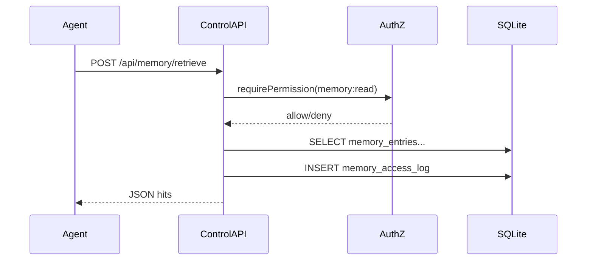

# Agent OS — Architecture

This document describes the **control plane** architecture for this repository: a Next.js application that provides OS-like primitives for agent fleets (memory, skills/pipelines, governance, audit) with SQLite persistence and optional external engines.

## Design goals

- **Agent-agnostic**: Any runtime (CrewAI, OpenClaw, custom) integrates via stable HTTP contracts (and optional MCP).
- **Persistent & auditable**: Mutations and sensitive reads leave traces in `audit_log` and domain-specific access logs.
- **Deployable everywhere**: Local dev, Raspberry Pi kiosk, or server behind reverse proxy—same codebase paths.

## Layered model

Inspired by layered “agent operating system” patterns (e.g. [SpharxTeam/AgentOS](https://github.com/SpharxTeam/AgentOS)):

| Layer | Responsibility | Primary surfaces in-repo |
|-------|----------------|---------------------------|
| **Experience** | Dashboards, approvals, explorers | `app/*` pages |
| **Control API** | CRUD, retrieval, policy gates | `app/api/*`, `lib/authz.js` |
| **Kernel data** | Durable records, migrations | `lib/db.js` (SQLite / sql.js) |
| **Adapters** | Harness push/pull, MCP, vector backends | `docs/harness-sdk.md`, `docs/agent-os/INTEGRATIONS.md` |

## Threat model (v1)

- **Actors**: human operators, agent runtimes, CI jobs.
- **Trust boundary**: anything holding `AGENT_OS_API_KEY` with role `agent-runtime` is treated as a semi-trusted peer (rate-limit at reverse proxy in production).
- **Data classes**: `public`, `internal`, `confidential` (stored on `memory_entries.sensitivity` and similar fields).
- **Assumption**: SQLite file on disk is protected by host filesystem permissions; use external secret store for API keys in production.

## Key flows

## Non-goals (v1)

- Replacing host OS or shipping a C++/Rust microkernel distribution.
- HA clustering for SQLite (see Phase C in roadmap: split services + Postgres/S3).

## Deployment context (Proxmox)

Agent runtimes (Hermes Workspace, OpenClaw) and **Honcho** run in separate LXCs; this app is the remote-aware control plane. See [PROXMOX_RUNTIME_STACK.md](./PROXMOX_RUNTIME_STACK.md).

## Related docs

- [PROXMOX_RUNTIME_STACK.md](./PROXMOX_RUNTIME_STACK.md)
- [HONCHO.md](./HONCHO.md)
- [MEMORY_MODEL.md](./MEMORY_MODEL.md)
- [SKILL_PIPELINE_SPEC.md](./SKILL_PIPELINE_SPEC.md)
- [GOVERNANCE.md](./GOVERNANCE.md)
- [INTEGRATIONS.md](./INTEGRATIONS.md)
- [Harness SDK — bundle format](../harness-sdk.md)
