# Agent OS — Diagrams

Copy Mermaid blocks into GitHub, Notion, Obsidian, or [mermaid.live](https://mermaid.live) for slides.

---

## 1. System context (C4 L1)

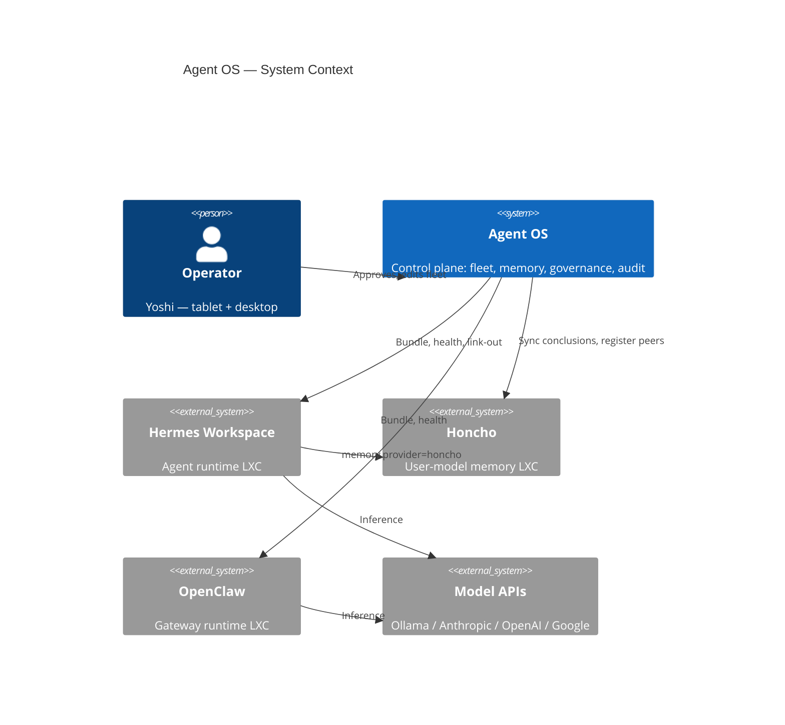

---

## 2. Physical LAN topology

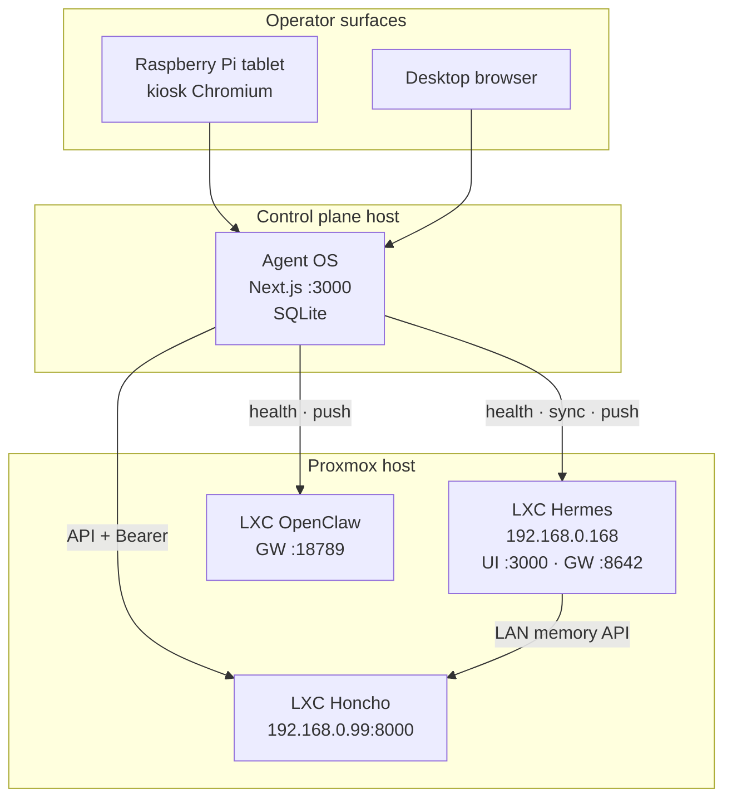

---

## 3. Logical planes

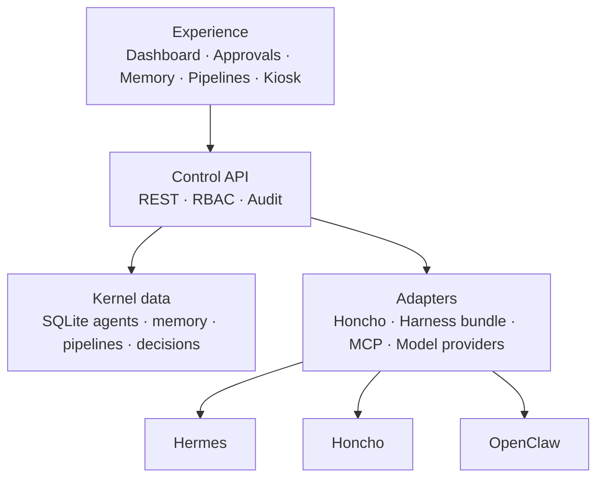

---

## 4. Runtime vs model vs memory (three axes)

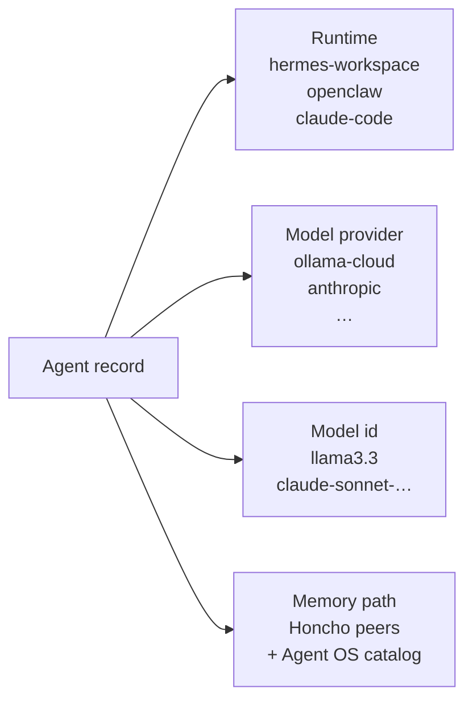

---

## 5. Memory source-of-truth

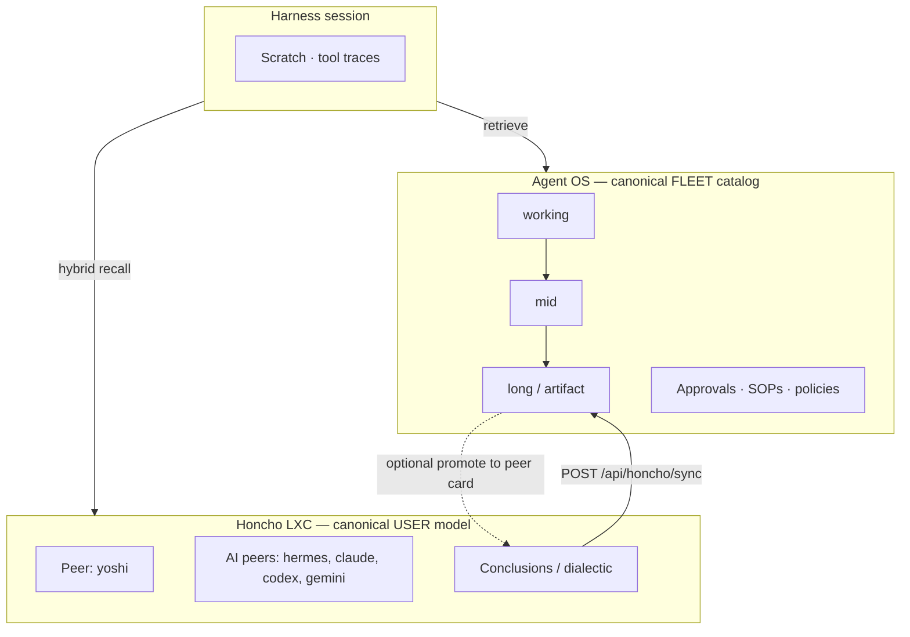

---

## 6. Governance / autonomy loop

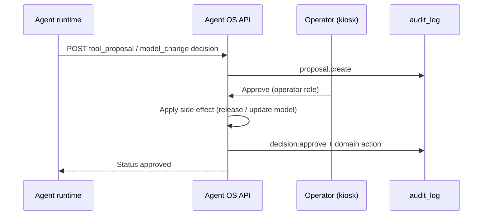

---

## 7. Harness bundle sync

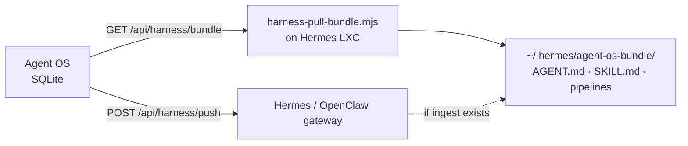

---

## 8. Device boot path (firmware)

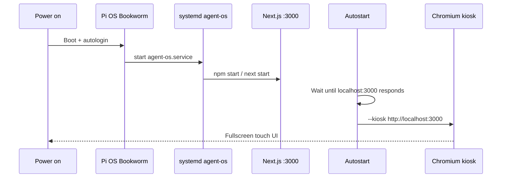

---

## 9. Phase roadmap (high level)

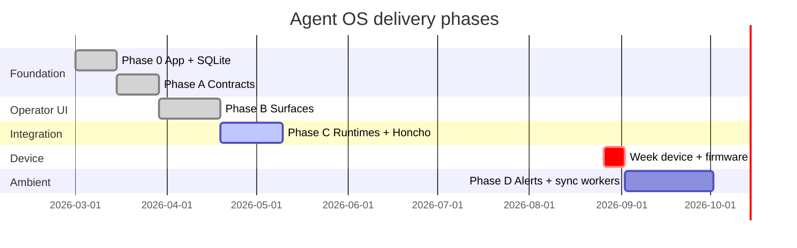

*(Adjust dates to your calendar; week bar is the presentation deadline.)*

---

## 10. C-suite fleet model

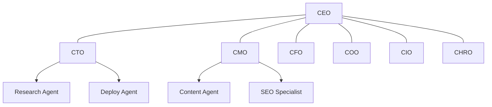

---

## 11. Threat model (simple)

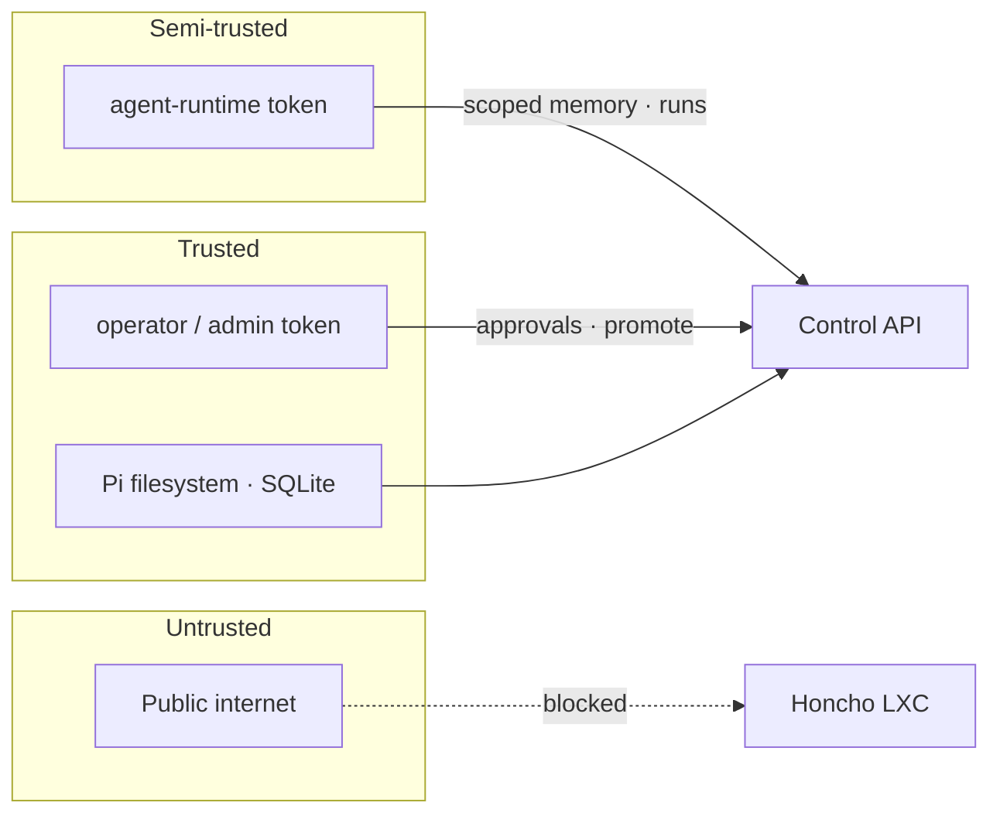

---

## Slide tips

- Prefer **§2 Physical**, **§4 Three axes**, **§6 Governance**, **§8 Boot** for a 10-minute pitch.
- Export PNG from mermaid.live at 2× for Keynote/PowerPoint.
- Keep dark background (#0a0a0a) and orange accent (#FF6B00 / #F97316) to match product UI.
