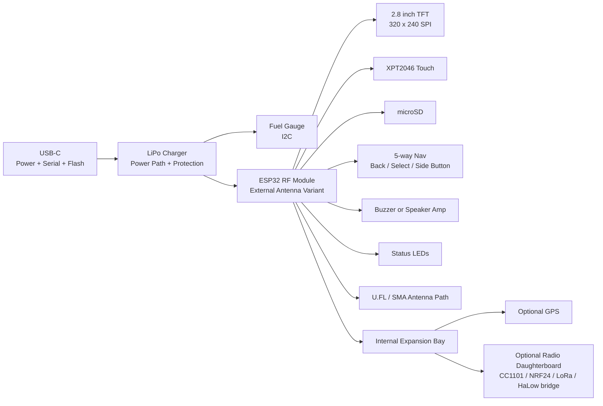

# CYD Pro RF Hardware Spec

**Status:** Draft 0.1  
**Product family:** HexMod Labs / pocket RF tools  
**Goal:** A grounded, souped-up 2.8 inch ESP32 CYD-style handheld for Marauder-class Wi-Fi/BLE work and possible HaleHound/HaLow experimentation.

---

## 1. Reality Baseline

Do not design this as if the CYD is a blank ESP32 dev board. The actual CYD baseline is already useful.

The common CYD / ESP32-2432S028R baseline includes:

- ESP32 with Wi-Fi and Bluetooth.
- 2.8 inch 320 x 240 LCD.
- Resistive touch.
- USB for power/programming.
- SD card slot.
- RGB LED.
- Speaker/amplifier connector.
- Several small Molex PicoBlade-style connectors.
- A small number of actually accessible GPIOs.

That means the real upgrade path is not simply "add ESP32-S3" or "add microSD". Some CYD-family variants already use S3-class chips, and the classic CYD already has SD. The Pro design should upgrade what actually hurts in field use:

- RF path and antenna quality.
- Power, charging, battery telemetry, and brownout resistance.
- Physical controls.
- Enclosure and serviceability.
- GPIO/expansion discipline.
- Firmware-target compatibility.
- Optional modular second-radio capability.

---

## 2. Product Positioning

**Working name:** CYD Pro RF  
**Plain-English shape:** Cheap Yellow Display, but built like a real pocket RF tool.

The device should feel like:

```text
Marauder / HaleHound-compatible handheld
  + CYD-size screen
  + real buttons
  + battery
  + external antenna
  + modular radio/GPS bay
  + clean firmware profiles
```

It should not become:

```text
Every radio on one board
  + no free pins
  + noisy power
  + broken Marauder compatibility
  + impossible enclosure
```

---

## 3. Two Hardware Targets

There should be two honest versions, not one muddled board.

### Target A: Marauder-Compatible CYD Pro

Use this if the first goal is high confidence with existing ESP32 Marauder-style builds.

| Area | Decision |
|---|---|
| MCU | ESP32-WROOM / ESP32-WROVER class, matching existing Marauder expectations |
| Display | 2.8 inch 320 x 240 SPI TFT, CYD-compatible pin map |
| Touch | XPT2046 resistive touch, CYD-compatible pin map |
| SD | microSD on the known CYD VSPI-style pins |
| RF | External 2.4 GHz antenna path, preferably module with U.FL/IPEX |
| Controls | D-pad / 5-way nav + Back + Select |
| Expansion | Internal mezzanine for GPS or second radio |

This is the safest first product because Marauder already has CYD-oriented configuration files and the stock CYD pin map is known.

### Target B: S3/HaLow-Oriented CYD Pro

Use this if HaleHound means a newer firmware stack, Wi-Fi HaLow companion control, USB host/device work, or richer UI.

| Area | Decision |
|---|---|
| MCU | ESP32-S3 module, preferably external antenna variant |
| Display | 2.8 inch SPI TFT unless firmware supports parallel/RGB display cleanly |
| Touch | XPT2046 or capacitive touch, but only if firmware support is planned |
| SD | microSD retained |
| RF | S3 Wi-Fi/BLE plus optional external co-processor/radio module |
| Expansion | Stronger: UART/I2C/SPI mezzanine, optional USB bridge |

This is more future-looking, but riskier for Marauder compatibility unless you intentionally port/test the firmware profile.

---

## 4. Recommended v0.1 Direction

Build **Target A first**: a Marauder-compatible CYD Pro with better RF, power, controls, and expansion.

Reason:

- It starts from the proven CYD hardware model.
- It avoids needing a firmware port before the hardware is useful.
- It keeps Marauder compatibility as the anchor.
- It still leaves a second board spin for S3/HaleHound once the use case is pinned down.

Design principle:

```text
Preserve the CYD-compatible core.
Upgrade everything around it.
Do not consume the few spare pins casually.
```

---

## 5. System Block Diagram



---

## 6. Stock CYD Pin Map to Respect

The common CYD pin map is pin-constrained. Treat these as occupied unless you are deliberately breaking compatibility.

### Display

| Function | GPIO |
|---|---:|
| TFT_DC / TFT_RS | IO2 |
| TFT_MISO / TFT_SDO | IO12 |
| TFT_MOSI / TFT_SDI | IO13 |
| TFT_SCK | IO14 |
| TFT_CS | IO15 |
| TFT_BL | IO21 |

### microSD

| Function | GPIO |
|---|---:|
| SD_CS / SS | IO5 |
| SD_SCK | IO18 |
| SD_MISO | IO19 |
| SD_MOSI | IO23 |

### Touch

| Function | GPIO |
|---|---:|
| XPT2046_CLK | IO25 |
| XPT2046_MOSI | IO32 |
| XPT2046_CS | IO33 |
| XPT2046_IRQ | IO36 |
| XPT2046_MISO | IO39 |

### Other Stock Functions

| Function | GPIO | Note |
|---|---:|---|
| BOOT button | IO0 | Can be used as input carefully |
| Speaker amp / DAC | IO26 | Existing audio path |
| LDR | IO34 | Input only |
| RGB LED red | IO4 | Active low |
| RGB LED green | IO16 | Active low |
| RGB LED blue | IO17 | Active low |
| Accessible GPIO | IO35 | Input only, no internal pull-up |
| Accessible GPIO / I2C candidate | IO22 | Shared on connectors |
| Accessible GPIO / I2C candidate | IO27 | On CN1 |
| Backlight | IO21 | Also appears on P3, but do not treat as spare |

---

## 7. Real Upgrade Map

| Upgrade | Worth Doing? | Why |
|---|---|---|
| External antenna ESP32 module | Yes | Biggest RF usability win |
| Better power path | Yes | Prevents brownouts during scan/transmit/UI use |
| Battery + fuel gauge | Yes | Field tool needs real battery telemetry |
| Physical controls | Yes | Touch-only is miserable outdoors |
| USB-C | Yes | Modern power/flash connector |
| Expansion mezzanine | Yes | Keeps v1 from becoming permanently overloaded |
| microSD | Already stock | Retain it; do not call it an upgrade |
| ESP32-S3 | Maybe | Upgrade only if firmware target supports it |
| GPS | Optional | Great for wardriving/logging, but module/pin planning matters |
| CC1101/NRF24/LoRa onboard | Not v1 | Put on daughterboard instead |
| HaLow onboard | Not v1 | HaLow generally needs a dedicated chipset/module, not just ESP32 |

---

## 8. Proposed Mainboard Architecture

### MCU

For v0.1, choose one:

| Module | Use When |
|---|---|
| ESP32-WROOM-32U | Maximum classic compatibility plus external antenna |
| ESP32-WROVER-IE | Need PSRAM and external antenna, firmware supports it |
| ESP32-S3-WROOM-1U / S3-WROOM-2U | New firmware profile, richer UI, USB native, future target |

Recommended v0.1:

```text
ESP32-WROVER-IE if Marauder build supports PSRAM cleanly.
ESP32-WROOM-32U if you want conservative compatibility.
```

### Display and Touch

Preserve a CYD-compatible 2.8 inch SPI TFT/touch arrangement:

- 320 x 240.
- SPI TFT.
- XPT2046 resistive touch for firmware compatibility.
- Backlight controlled by GPIO/PWM.

If using a different controller such as ST7789 instead of ILI9341, treat that as a firmware profile choice, not a drop-in detail.

### Storage

Retain microSD, but improve it:

- Better socket placement.
- Push-push or push-pull socket accessible from enclosure edge.
- Card detect switch if pins allow, otherwise skip.
- ESD near socket.
- Clear silkscreen: `LOGS / PCAPS / CONFIG`.

---

## 9. Controls

Add physical controls using an I2C GPIO expander instead of consuming raw ESP32 pins.

Recommended:

```text
MCP23008 or TCA9555 on I2C
  -> Up
  -> Down
  -> Left
  -> Right
  -> Center/OK
  -> Back
  -> Select/Menu
  -> Side/Favorite
```

Use the CYD-friendly I2C candidates:

| Net | GPIO | Note |
|---|---:|---|
| `I2C_SCL_UI` | IO22 | CYD accessible |
| `I2C_SDA_UI` | IO27 | CYD accessible |

This preserves the few raw GPIOs and makes button routing sane.

---

## 10. Expansion Bay

Use a small internal mezzanine connector for one daughterboard at a time. On a CYD-compatible pin map, make this **I2C-first**. Do not promise raw UART/SPI expansion unless you have deliberately freed pins or added a bridge chip.

### J20 Expansion Bay Connector

```text
J20, 2x8 internal mezzanine

1  +3V3_EXP_SW       2  GND
3  +5V_EXP_SW        4  GND
5  I2C_SCL_UI        6  I2C_SDA_UI
7  EXP_INT           8  EXP_RESET_N
9  EXP_GPIO0         10 EXP_GPIO1
11 BRIDGE_TX_OPT     12 BRIDGE_RX_OPT
13 MODULE_ID0        14 MODULE_ID1
15 EXP_PRESENT_N     16 GND
```

Recommended population options:

| Daughterboard | Purpose | Interface |
|---|---|---|
| GPS board | Wardriving logs/location | I2C GPS, or UART through SC16IS752-style I2C bridge |
| CC1101 board | Sub-GHz experiments | Daughterboard MCU or SPI bridge, not raw v0.1 CYD pins |
| NRF24 board | 2.4 GHz experiments | Daughterboard MCU recommended |
| LoRa board | Long-range low-rate telemetry | I2C/UART bridge or daughterboard MCU |
| HaLow bridge board | Control external HaLow module | Project-specific bridge/backpack |

Do not populate all of these on the mainboard. Make the expansion bay the product feature.

If you need true raw SPI expansion, make that a separate **S3 Pro** hardware target with a new pin map rather than compromising Marauder-compatible CYD behavior.

---

## 11. HaleHound / HaLow Reality Check

I could not verify a public project named exactly **HaleHound** from current web results. If HaleHound is your own name or a private/new project, design the hardware around the actual radio stack it needs.

If HaleHound means **Wi-Fi HaLow**:

- ESP32 alone does not provide 802.11ah HaLow.
- HaLow needs a dedicated HaLow chipset/module.
- Most practical HaLow modules will communicate over USB, SDIO, SPI, or UART depending on module.
- A 2.8 inch ESP32 handheld can be a **controller/UI** for a HaLow module, but it is not itself a HaLow radio unless that module is added.

Recommended approach:

```text
CYD Pro RF
  -> controls/status/config
  -> serial/USB bridge
  -> external HaLow module or backpack
```

Do not force HaLow onto the v0.1 mainboard unless the exact module, host interface, driver, and firmware are already known.

---

## 12. Power System

### Required

| Block | Recommendation |
|---|---|
| USB-C | 5V input, ESD, proper CC resistors or power controller |
| Charger | Single-cell LiPo charger with power-path management |
| Fuel gauge | I2C gauge such as MAX17048-class |
| Regulator | 3.3V rail sized for ESP32 peak current, display, SD, expansion |
| Power switch | Real slide switch or soft-latch |
| Brownout margin | Bulk capacitance near ESP32 and radio rails |

### Suggested Rails

| Rail | Use |
|---|---|
| `+5V_USB` | USB input |
| `VBAT` | LiPo battery |
| `+3V3_MAIN` | ESP32, display logic, SD, touch |
| `+3V3_RF` | ESP32 RF module / expansion radio |
| `+3V3_EXP_SW` | Switched expansion |
| `+5V_EXP_SW` | Switched expansion if module needs 5V |

---

## 13. Enclosure and UX

Front layout:

```text
+--------------------------+
|        2.8 inch TFT      |
|                          |
+--------------------------+
|  Back   D-pad/OK   Menu  |
+--------------------------+
```

Top edge:

```text
[SMA antenna] [optional expansion antenna]
```

Side edge:

```text
[USB-C] [Power] [Boot/Reset pinhole]
```

Back:

```text
[LiPo bay/service screws]
[Expansion daughterboard door]
[Device label: firmware/profile/MAC]
```

Field UX requirements:

- Operable without touch.
- Screen readable in daylight.
- Antenna not blocked by hand.
- SD card accessible without opening device.
- Reset/boot accessible without disassembly.

---

## 14. Firmware Profiles

Design the board support package as profiles.

```text
profile_marauder_cyd_pro
  MCU: ESP32-WROOM/WROVER
  Display: CYD-compatible 2.8 SPI
  Touch: XPT2046
  SD: enabled
  Controls: I2C expander
  Expansion: optional

profile_halehound_controller
  MCU: ESP32-S3 or ESP32 classic
  Display: CYD-compatible 2.8 SPI
  Touch: optional
  Controls: I2C expander
  Expansion: HaLow bridge/backpack
```

Name the second profile only after the HaleHound target is confirmed.

---

## 15. Prototype Plan

### Phase 0: Stock CYD Baseline

Goal: confirm firmware and UI expectations.

Acceptance tests:

- Flash Marauder to stock CYD or known CYD-compatible board.
- Confirm display orientation and touch calibration.
- Confirm SD logging.
- Confirm which buttons/UI paths are painful.
- Confirm which GPIOs are actually free on the chosen board.

### Phase 1: CYD Backpack Prototype

Goal: add real upgrades without custom mainboard risk.

Backpack adds:

- Battery/fuel gauge.
- 5-way nav via I2C expander.
- GPS via UART or I2C bridge.
- External antenna mod if using U.FL ESP32 module/dev board.

Acceptance tests:

- I2C controls work.
- Fuel gauge reports.
- GPS logs to SD.
- Device stays stable on battery.

### Phase 2: CYD Pro RF Mainboard

Goal: custom board preserving CYD-compatible firmware map.

Acceptance tests:

- Firmware builds with CYD-style display/touch/SD config.
- External antenna module improves practical RF usability.
- Buttons work without stealing core pins.
- Expansion bay powers on/off cleanly.
- Battery runtime and thermal behavior are measured.

### Phase 3: S3/HaleHound Variant

Only start once the HaleHound target is concrete.

Acceptance tests:

- Target firmware compiles for S3 or selected MCU.
- HaLow/radio module interface is proven on dev hardware.
- UI controller role is clear.
- Expansion bay pinout survives without respin.

---

## 16. v0.1 KiCad Blocks

Create these schematic sheets:

1. `mcu_esp32_compat.sch`
2. `display_touch_cyd_28.sch`
3. `microsd.sch`
4. `usb_c_power_charging.sch`
5. `battery_fuel_gauge.sch`
6. `buttons_i2c_expander.sch`
7. `rf_antenna_path.sch`
8. `expansion_bay.sch`
9. `audio_leds_status.sch`
10. `testpoints_programming.sch`

---

## 17. Source Notes

Current public references checked for this draft:

- CYD community documentation: https://github.com/witnessmenow/ESP32-Cheap-Yellow-Display
- CYD pin documentation: https://raw.githubusercontent.com/witnessmenow/ESP32-Cheap-Yellow-Display/main/PINS.md
- CYD variants documentation: https://raw.githubusercontent.com/witnessmenow/ESP32-Cheap-Yellow-Display/main/Variants/README.md
- ESP32 Marauder repository: https://github.com/justcallmekoko/ESP32Marauder
- ESP32 Marauder CYD setup file: https://raw.githubusercontent.com/justcallmekoko/ESP32Marauder/master/User_Setup_cyd_2usb.h
