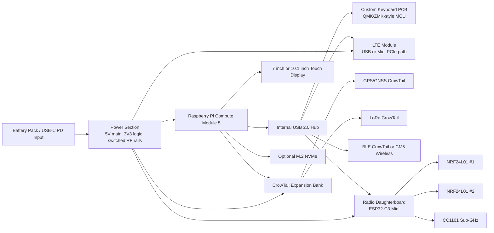

# Handheld Cyberdeck Hardware Starter Spec

**Status:** Draft 0.1  
**Product family:** HexMod Labs / Cyberdeck Trinity candidate  
**Goal:** Handheld Raspberry Pi cyberdeck with custom PCB mainboard, custom keyboard, CrowTail expansion modules, and an ESP32-C3 radio daughterboard.

---

## 1. Product Intent

Build a handheld field computer that feels like a real portable terminal, not a Pi taped to a keyboard. The device should support Linux workflows, packet/radio experimentation, GPS/GNSS positioning, cellular uplink, LoRa experimentation, Bluetooth peripherals, and a custom keyboard.

The first version should be optimized for builder success:

- Use Raspberry Pi Compute Module 5 as the Linux compute module.
- Use a custom CM5 carrier/mainboard instead of a full-size Raspberry Pi board.
- Keep RF-heavy subsystems modular so antenna, noise, and compliance issues can be debugged independently.
- Make the keyboard a separate PCB with its own MCU.
- Make the ESP32-C3 radio subsystem a removable daughterboard.
- Keep CrowTail modules replaceable during early prototypes.

---

## 2. High-Level Requirements

| Area | Requirement | Draft Decision |
|---|---|---|
| Compute | Raspberry Pi-based Linux host | Raspberry Pi Compute Module 5 |
| Display | Nice handheld display | 7 inch HDMI/USB touch for prototype; 10.1 inch wide display for larger field-terminal variant |
| Keyboard | Custom PCB keyboard | Separate USB keyboard PCB, low-profile switches |
| Mainboard | Custom PCB | CM5 carrier board with power, USB hub, display, CrowTail headers, daughterboard connector |
| Bluetooth | Required | Prefer CM5 with onboard wireless if acceptable; otherwise CrowTail BLE module over UART/I2C |
| LoRa | Required via CrowTail | CrowTail LoRa/LoRaWAN module bay |
| GPS/GNSS | Required via CrowTail | CrowTail GPS/GNSS module bay |
| LTE | Required via CrowTail/modules | LTE module over USB, Mini PCIe, or CrowTail style carrier, region-specific variant |
| Extra radios | Required daughterboard | ESP32-C3 Mini + dual NRF24L01 + CC1101 |
| Power | Portable battery | USB-C PD input plus internal Li-ion pack design in later revision |
| Expansion | Serviceable and hackable | Internal headers, debug pads, removable daughterboard |

---

## 3. System Block Diagram



---

## 4. Compute and Mainboard

### Recommended Compute Module

Use **Raspberry Pi Compute Module 5**.

Why:

- It is designed for custom carrier boards.
- Raspberry Pi provides CM5 and CM5IO documentation and design references.
- CM5IO exposes useful patterns for power, power button, RTC battery, display, HDMI, and IO.
- CM5IO documents USB-C power using 5V at 5A or 5V at 3A with a reduced peripheral budget.

### Mainboard Responsibilities

The mainboard should carry:

- CM5 board-to-board connectors.
- USB-C PD input.
- 5V high-current rail.
- 3.3V logic rail.
- Switched RF/module rails for LTE, LoRa, GNSS, and radio daughterboard.
- USB 2.0 hub.
- Display connector path.
- Keyboard USB/internal connector.
- CrowTail-compatible module headers.
- Radio daughterboard connector.
- RTC battery socket.
- Fan header or blower connector.
- Boot/recovery jumper access.
- UART debug header.
- M.2 2230/2242 NVMe footprint if space allows.

### Board Strategy

Do not make the first PCB an all-in-one board. Split it into:

1. **Mainboard:** CM5 carrier, power, display, USB hub, expansion.
2. **Keyboard PCB:** switches, matrix MCU, optional LEDs.
3. **Radio daughterboard:** ESP32-C3 Mini, dual NRF24L01, CC1101.
4. **Optional power/battery board:** charger, gauge, protection, pack connector.

This keeps the highest-risk pieces replaceable.

---

## 5. Display

### Prototype Display

Use a 7 inch HDMI/USB touchscreen for the first bench prototype.

Reasons:

- Easiest Linux bring-up.
- Touch generally appears over USB HID.
- HDMI avoids early MIPI DSI routing mistakes.
- Easier enclosure iteration.

### Larger Display Variant

A 10.1 inch wide display can be used for a more serious field-terminal feel. Elecrow currently sells Raspberry Pi display products in the 10.1 inch category, including a 1520x720 capacitive touch option.

### Mainboard Design Note

Expose at least one stable display route:

- **Prototype route:** HDMI + USB touch.
- **Integrated route:** MIPI DSI FPC if the selected panel and cable stack are finalized.

Do not lock the mainboard to a mystery DSI panel until the exact display, pinout, cable, mounting, and Linux overlay behavior are tested.

---

## 6. CrowTail Module Bay

The CrowTail bay should be treated as a semi-modular expansion area, not a permanent promise that every module uses the same bus.

### Required CrowTail Functions

| Function | Likely Interface | Notes |
|---|---|---|
| Bluetooth/BLE | UART, USB, or I2C depending on module | CM5 wireless may satisfy this if acceptable |
| LoRa/LoRaWAN | UART or SPI depending on module | Elecrow lists a CrowTail LoRaWAN RA-08H/LR1262 803-930 MHz module |
| GPS/GNSS | UART | Keep antenna away from LTE/Wi-Fi noise |
| LTE | USB preferred | Verify US bands and carrier support before purchase |

### LTE Decision

For LTE, prefer a USB or Mini PCIe cellular module path instead of forcing a low-bandwidth CrowTail UART pattern. Elecrow currently lists several cellular options, including SIM7670 Mini PCIe variants and SIM7600G-PCIE. The Crowtail-4G SIM A7670E GPS board was listed but out of stock during this draft.

### CrowTail Connector Bank Draft

Provide four labeled ports:

| Port | Voltage | Bus | Intended Module |
|---|---:|---|---|
| CT-UART1 | 3.3V/5V selectable | UART | GPS/GNSS |
| CT-UART2 | 3.3V/5V selectable | UART | BLE or LoRa |
| CT-I2C | 3.3V/5V selectable | I2C | Sensors, utility modules |
| CT-GPIO/SPI | 3.3V only preferred | SPI/GPIO | LoRa or misc modules |

Add level shifting where 5V CrowTail compatibility is required.

---

## 7. Radio Daughterboard

### Daughterboard Purpose

The radio daughterboard keeps experimental RF away from the mainboard and lets the cyberdeck evolve without respinning the CM5 carrier every time a radio choice changes.

### Core Components

| Component | Role | Interface |
|---|---|---|
| ESP32-C3-MINI-1 or ESP32-C3-MINI-1U | Radio supervisor MCU | USB to CM5, SPI to radios |
| NRF24L01 #1 | 2.4 GHz radio | SPI |
| NRF24L01 #2 | Second 2.4 GHz radio | SPI |
| CC1101 | Sub-GHz transceiver | SPI |

### ESP32-C3 Notes

Use the ESP32-C3 module version intentionally:

- **ESP32-C3-MINI-1:** PCB antenna, simpler BOM, needs antenna keepout.
- **ESP32-C3-MINI-1U:** external antenna connector, better for enclosure-controlled RF.

For this device, the **MINI-1U** is probably better because the enclosure will already need external or edge-mounted antennas.

### SPI Topology

Use one shared SPI bus if pin pressure matters:

| Signal | Shared? | Notes |
|---|---|---|
| SCLK | Yes | Common to NRF24 #1, NRF24 #2, CC1101 |
| MOSI | Yes | Common |
| MISO | Yes | Common |
| CS_NRF1 | No | Separate chip select |
| CS_NRF2 | No | Separate chip select |
| CS_CC1101 | No | Separate chip select |
| IRQ_NRF1 | No | Dedicated interrupt |
| IRQ_NRF2 | No | Dedicated interrupt |
| GDO0_CC1101 | No | Dedicated interrupt/status |
| GDO2_CC1101 | Optional | Useful for packet/status timing |

### Daughterboard Connector Draft

Use a board-to-board connector or keyed mezzanine/header carrying:

| Pin Group | Signals |
|---|---|
| Power | 5V, 3V3, GND |
| USB | USB D+, USB D- |
| Control | RESET, BOOT, ENABLE |
| Debug | UART TX/RX, optional JTAG |
| Status | 2 to 4 GPIO lines back to CM5 |
| Reserve | 4 to 8 spare pins |

Keep radio SPI local to the ESP32-C3 daughterboard. Do not route raw radio SPI back to the CM5 unless there is a strong reason.

---

## 8. Bus and Interface Budget

### Raspberry Pi CM5 Side

| Interface | Consumer | Priority |
|---|---|---|
| USB 2.0 root -> hub | Keyboard, LTE, ESP32-C3 radio board, optional BLE | Critical |
| HDMI or DSI | Display | Critical |
| PCIe | Optional NVMe | High |
| UART0/debug | Console/debug | High |
| I2C | CrowTail sensors, power gauge, RTC if needed | Medium |
| GPIO | Power enable lines, module detect, buttons | Medium |
| SPI | Optional CrowTail SPI module | Low; avoid using Pi SPI for radio daughterboard |

### ESP32-C3 Side

| Interface | Consumer | Priority |
|---|---|---|
| USB CDC | Pi host command/control | Critical |
| SPI | NRF24 #1, NRF24 #2, CC1101 | Critical |
| GPIO interrupts | NRF IRQs, CC1101 GDO pins | Critical |
| UART debug | Bring-up and recovery | High |
| BOOT/EN pins | Firmware flashing | Critical |

---

## 9. Power Architecture

### Prototype Power

Start with external USB-C PD power and known-good regulator modules. Do not combine battery charging, LTE bursts, and CM5 carrier bring-up on the first custom PCB.

### Product Power

Target rails:

| Rail | Use | Notes |
|---|---|---|
| 5V_MAIN | CM5, USB hub, display, LTE | Size for CM5 plus LTE bursts |
| 3V3_MAIN | Logic, CrowTail, daughterboard | Low-noise regulator preferred |
| 3V3_RF | NRF24/CC1101/ESP32 radio board | Switchable and filtered |
| LTE_PWR | LTE module | Dedicated high-current path, bulk capacitance |
| BACKLIGHT | Display backlight | Depends on selected panel |

### Power Controls

Add load switches for:

- LTE module.
- Radio daughterboard.
- CrowTail module bank.
- Display/backlight.

This gives Linux software a way to recover wedged peripherals and saves battery.

---

## 10. Mechanical and UX Requirements

### Handheld Envelope

Two candidate sizes:

| Variant | Display | Feel |
|---|---|---|
| Compact | 7 inch | Actually handheld, chunky terminal |
| Field | 10.1 inch | More readable, less pocketable |

### Layout

Preferred front layout:

```text
+--------------------------------------------------+
|                    Display                       |
|                                                  |
+--------------------------------------------------+
| Custom keyboard matrix                           |
| [mod row] [trackball/thumbstick] [status LEDs]   |
+--------------------------------------------------+
```

Preferred internal stack:

```text
Top shell
Display
Mainboard behind display
Keyboard PCB in lower half
Battery pack behind keyboard or under palm area
Radio daughterboard near antenna edge
Bottom shell
```

### Antenna Placement

Reserve separate antenna zones for:

- LTE main.
- LTE diversity/GNSS if module supports it.
- GNSS patch or active antenna.
- LoRa antenna.
- CC1101 sub-GHz antenna.
- ESP32-C3 Wi-Fi/BLE antenna.
- NRF24 external antennas if using PA/LNA modules.

Do not bury antennas under the battery, display metalwork, or keyboard ground flood.

---

## 11. Prototype Plan

### Phase 0: Bench Prototype

Goal: prove software and module compatibility before custom PCB.

Bill of materials:

- Raspberry Pi CM5 + CM5IO board.
- 7 inch HDMI/USB touchscreen.
- USB keyboard.
- USB hub.
- Candidate LTE module.
- CrowTail GPS/GNSS.
- CrowTail LoRa.
- CrowTail BLE if not using CM5 wireless.
- ESP32-C3 dev board.
- 2x NRF24L01 modules.
- CC1101 module.

Acceptance tests:

- Pi boots reliably.
- Display and touch work from cold boot.
- LTE connects and survives reconnect/power cycling.
- GPS/GNSS produces fix outdoors.
- LoRa module sends/receives test packets legally in the chosen region.
- ESP32-C3 enumerates as USB serial.
- ESP32-C3 can independently talk to both NRF24 modules and CC1101.

### Phase 1: Radio Daughterboard PCB

Goal: validate radio topology before touching the CM5 carrier.

Acceptance tests:

- ESP32-C3 firmware flashing works over USB.
- Each radio is detectable on SPI.
- No SPI bus contention when all radios are populated.
- IRQ lines work.
- Current draw is measured in idle, RX, and TX modes.
- External antenna/mechanical placement is understood.

### Phase 2: Keyboard PCB

Goal: make the cyberdeck usable as a handheld terminal.

Acceptance tests:

- Matrix scans cleanly.
- USB HID works in Raspberry Pi OS.
- Keymap is usable in terminal workflows.
- No ghosting for expected modifier combinations.
- Mounting points align with enclosure concept.

### Phase 3: CM5 Mainboard PCB

Goal: integrate proven pieces.

Acceptance tests:

- CM5 boots from eMMC or NVMe.
- USB hub sees keyboard, LTE, and radio daughterboard.
- Display route works.
- LTE power switch and reset work.
- CrowTail ports work at intended voltages.
- Thermal behavior is acceptable under sustained load.

---

## 12. Key Unknowns to Resolve Before KiCad

1. Exact display model, resolution, interface, cable path, and mounting pattern.
2. Exact LTE module and target region/carrier.
3. Whether CM5 onboard wireless satisfies Bluetooth or whether a CrowTail BLE module is mandatory.
4. Exact keyboard layout: 40%, 50%, thumb cluster, trackball, joystick, or mouse keys only.
5. Battery strategy: removable pack, internal Li-ion, USB-C PD only, or hybrid.
6. Enclosure manufacturing path: 3D print, CNC, laser-cut sandwich, or injection-mold future.
7. Antenna strategy for every radio.
8. Whether the device is personal prototype only or eventually sold as a kit/product.

---

## 13. Safety, Legal, and Compliance Guardrails

- LTE modules must match the deployment region and carrier bands.
- LoRa, CC1101, NRF24, and LTE transmission must follow local spectrum rules.
- If sold, the device may need FCC/CE/UKCA and carrier-related review.
- Use pre-certified radio modules where possible.
- Do not design the enclosure so users can accidentally touch battery terminals, high-current rails, or RF power stages.
- Include fusing, reverse-current protection, and battery protection if adding internal batteries.

---

## 14. Source Notes

Current public references checked for this draft:

- Raspberry Pi Compute Module documentation: https://www.raspberrypi.com/documentation/computers/compute-module.html
- Espressif ESP32-C3-MINI-1 module page: https://www.espressif.com/en/products/modules/esp32-c3-mini-1
- TI CC1101 product page: https://www.ti.com/product/CC1101
- Elecrow CrowTail wireless communication category: https://www.elecrow.com/steam-education/crowtail/wireless-communication.html
- Elecrow cellular network category: https://www.elecrow.com/iot/2-4g-cellular-network.html

---

## 15. Immediate Next Decisions

Before schematic capture, pick:

1. Compact 7 inch or field-terminal 10.1 inch size.
2. CM5 RAM/eMMC/wireless variant.
3. LTE module and target carrier/region.
4. Keyboard layout.
5. Enclosure strategy.

Once those are chosen, the next artifact should be a KiCad-oriented pin budget with exact connector pin numbers, power rails, and mechanical keepouts.
