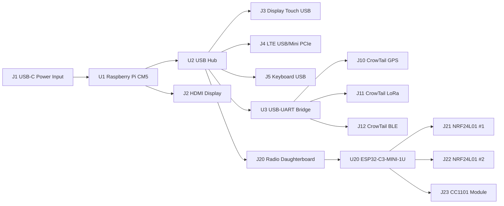

# Handheld Cyberdeck KiCad Pinout Draft

**Status:** Draft 0.1  
**Use:** Schematic net labels, connector symbols, and first PCB partitioning  
**Parent spec:** `proposals/HANDHELD-CYBERDECK-HARDWARE-SPEC.md`

This is a KiCad-facing pinout proposal for the handheld CM5 cyberdeck. It gives exact CM5 pin numbers for the interfaces used by this design, exact ESP32-C3-MINI-1/1U module pin numbers for the radio daughterboard, and practical connector pinouts for the removable modules.

Important: for CrowTail and commodity radio breakout modules, confirm the final purchased module schematic before ordering PCBs. CrowTail product pages confirm module functions and voltage ranges, but off-the-shelf board header order can vary between product generations.

---

## 1. Top-Level Net Diagram



---

## 2. CM5 Mainboard Required Pins

Use the official Raspberry Pi CM5 symbol if available. The tables below are the nets this cyberdeck actually uses.

### 2.1 Power, Control, RTC, and LEDs

| CM5 Pin | CM5 Signal | Cyberdeck Net | KiCad Note |
|---:|---|---|---|
| 77 | 5V Input | `+5V_CM5` | Main 5V input |
| 79 | 5V Input | `+5V_CM5` | Main 5V input |
| 81 | 5V Input | `+5V_CM5` | Main 5V input |
| 83 | 5V Input | `+5V_CM5` | Main 5V input |
| 85 | 5V Input | `+5V_CM5` | Main 5V input |
| 87 | 5V Input | `+5V_CM5` | Main 5V input |
| 76 | VBAT | `RTC_VBAT_3V` | Coin cell/supercap, 2.5V to 3.5V |
| 78 | GPIO_VREF | `CM5_3V3` | Must not float; tie to pins 84/86 for 3.3V GPIO |
| 84 | CM5_3.3V Output | `CM5_3V3` | 300 mA per pin, 600 mA total with pin 86 |
| 86 | CM5_3.3V Output | `CM5_3V3` | Use as reference/logic only, not bulk module power |
| 88 | CM5_1.8V Output | `CM5_1V8` | Leave mostly unused unless needed |
| 90 | CM5_1.8V Output | `CM5_1V8` | Leave mostly unused unless needed |
| 92 | PWR_Button | `CM5_PWR_BTN_N` | Momentary switch to GND |
| 93 | nRPIBOOT | `CM5_RPIBOOT_N` | Jumper/test pad to GND for boot server mode |
| 95 | LED_nPWR | `LED_PWR_N` | Buffer before LED |
| 99 | PMIC_Enable | `CM5_PMIC_EN` | Optional power controller can pull low |
| 21 | LED_nACT | `LED_ACT_N` | Activity LED, active low |
| 89 | WL_nDisable | `CM5_WIFI_DISABLE_N` | Leave floating or open-drain pull low |
| 91 | BT_nDisable | `CM5_BT_DISABLE_N` | Leave floating or open-drain pull low |

Connect all CM5 GND pins on installed connectors to the board ground plane. Do not power external modules from `CM5_3V3` except very small logic/reference loads.

### 2.2 USB-C Power Input

Use this if J1 is the CM5-style 5V USB-C power input.

| USB-C Connector Pin/Signal | Cyberdeck Net | CM5 Pin | CM5 Signal | Note |
|---|---|---:|---|---|
| VBUS | `+5V_IN` -> power path -> `+5V_CM5` | 77/79/81/83/85/87 | 5V Input | Add fuse/current protection |
| GND | `GND` | all relevant GND | GND | Ground plane |
| CC1 | `USB_C_CC1` | 94 | CC1 | CM5 USB PSU PD signal |
| CC2 | `USB_C_CC2` | 96 | CC2 | CM5 USB PSU PD signal |

If you use a separate USB-C PD sink controller or battery charger instead of the CM5-style direct power input, do not blindly duplicate this connection. Pick one power negotiation architecture.

### 2.3 USB 2.0 Root to Internal USB Hub

| CM5 Pin | CM5 Signal | Cyberdeck Net | Destination |
|---:|---|---|---|
| 101 | USB_OTG_ID | `USB_OTG_ID_HOST` | Tie to GND through 0R/jumper for host mode |
| 103 | USB_N | `USB2_UP_D_N` | USB hub upstream D- |
| 105 | USB_P | `USB2_UP_D_P` | USB hub upstream D+ |
| 111 | VBUS_EN | `USB3_VBUS_EN` | USB3 port power-control signal; do not depend on it as the USB2 hub enable |

For fixed USB host use, add `dtoverlay=dwc2,dr_mode=host` to the Pi config.

Recommended hub downstream allocation:

| Hub Port | Destination | Nets |
|---|---|---|
| 1 | Keyboard PCB | `USB_KBD_D_P`, `USB_KBD_D_N`, `+5V_KBD`, `GND` |
| 2 | LTE module | `USB_LTE_D_P`, `USB_LTE_D_N`, `+5V_LTE`, `GND` |
| 3 | Radio daughterboard ESP32-C3 | `USB_RADIO_D_P`, `USB_RADIO_D_N`, `+5V_RADIO_SW`, `GND` |
| 4 | USB-UART bridge for CrowTail UART ports | `USB_UARTBR_D_P`, `USB_UARTBR_D_N`, `+5V_PERIPH`, `GND` |
| 5 | Display touch USB | `USB_TOUCH_D_P`, `USB_TOUCH_D_N`, `+5V_TOUCH`, `GND` |
| 6/7 | Spare/internal debug | `USB_SPARE*_D_P/N` |

Use a 7-port hub if you want LTE, radio, keyboard, touch, and UART bridge all internal without juggling ports.

### 2.4 HDMI0 Display Connector

Use HDMI0 for the main display. Route as controlled-impedance differential pairs.

| CM5 Pin | CM5 Signal | Cyberdeck Net | HDMI Connector Signal |
|---:|---|---|---|
| 170 | HDMI0_TX2_P | `HDMI0_D2_P` | TMDS Data2+ |
| 172 | HDMI0_TX2_N | `HDMI0_D2_N` | TMDS Data2- |
| 176 | HDMI0_TX1_P | `HDMI0_D1_P` | TMDS Data1+ |
| 178 | HDMI0_TX1_N | `HDMI0_D1_N` | TMDS Data1- |
| 182 | HDMI0_TX0_P | `HDMI0_D0_P` | TMDS Data0+ |
| 184 | HDMI0_TX0_N | `HDMI0_D0_N` | TMDS Data0- |
| 188 | HDMI0_CLK_P | `HDMI0_CLK_P` | TMDS Clock+ |
| 190 | HDMI0_CLK_N | `HDMI0_CLK_N` | TMDS Clock- |
| 199 | HDMI0_SDA | `HDMI0_SDA` | DDC SDA |
| 200 | HDMI0_SCL | `HDMI0_SCL` | DDC SCL |
| 153 | HDMI0_HOTPLUG | `HDMI0_HPD` | Hot plug detect |
| 151 | HDMI0_CEC | `HDMI0_CEC` | Optional CEC |

Add HDMI ESD protection and observe the HDMI connector pinout for shields and pair grounds.

### 2.5 Optional MIPI Display/Camera Reserve

If you decide to support a DSI display later, reserve MIPI0 or MIPI1 as an FPC footprint but do not route it to the first board unless the exact panel is chosen.

| CM5 Pins | Signal Group | Suggested Use |
|---|---|---|
| 115/117/121/123/127/129/133/135/139/141 | MIPI0 lanes/clock | Optional DSI/CSI FPC reserve |
| 175/177/181/183/187/189/193/195/194/196 | MIPI1 lanes/clock | Optional DSI/CSI FPC reserve |
| 80/82 | SCL0/SDA0 | MIPI camera/display control I2C |
| 97/100 | CAM_GPIO0/1 | MIPI peripheral control |

---

## 3. CrowTail Connector Pinout

Use standard Grove/CrowTail 4-pin cable convention for your carrier footprints:

```text
J_CT_x, board connector view

Pin 1  SIG1 / yellow
Pin 2  SIG2 / white
Pin 3  VCC  / red
Pin 4  GND  / black
```

Use JST-PH 2.0 mm 1x4 if matching Grove-style cables. Confirm against the exact Elecrow cable/connector footprint you order.

### 3.1 CrowTail GPS UART

Elecrow lists the CrowTail GPS as a 5V input, serial-communication NEO-6M module with default baud 9600 and configurable baud rates.

| J10 Pin | Net | Direction From Mainboard | Notes |
|---:|---|---|---|
| 1 | `CT_GPS_TX_TO_MOD_RX` | Output | Host UART TX through level shifter |
| 2 | `CT_GPS_RX_FROM_MOD_TX` | Input | Host UART RX through level shifter |
| 3 | `+5V_CT_GPS_SW` | Power | Switched 5V |
| 4 | `GND` | Ground | Ground |

### 3.2 CrowTail LoRa UART

Elecrow's CrowTail LoRa RA-08H/LR1262 product page lists 3.3V to 5V input, 803 to 930 MHz support, and download/communication switching. Treat the board as a UART module unless the exact selected variant's schematic says otherwise.

| J11 Pin | Net | Direction From Mainboard | Notes |
|---:|---|---|---|
| 1 | `CT_LORA_TX_TO_MOD_RX` | Output | Host UART TX through level shifter |
| 2 | `CT_LORA_RX_FROM_MOD_TX` | Input | Host UART RX through level shifter |
| 3 | `+5V_CT_LORA_SW` or `+3V3_CT_LORA_SW` | Power | Match selected module jumper/spec |
| 4 | `GND` | Ground | Ground |

Add optional test pads for module mode/download pins if the chosen LoRa board exposes them.

### 3.3 CrowTail BLE UART

Elecrow's CrowTail BLE page describes the HM-13 board as a transparent wireless serial module and includes a 4-pin CrowTail cable.

| J12 Pin | Net | Direction From Mainboard | Notes |
|---:|---|---|---|
| 1 | `CT_BLE_TX_TO_MOD_RX` | Output | Host UART TX through level shifter |
| 2 | `CT_BLE_RX_FROM_MOD_TX` | Input | Host UART RX through level shifter |
| 3 | `+5V_CT_BLE_SW` | Power | Verify selected module schematic |
| 4 | `GND` | Ground | Ground |

### 3.4 UART Source Recommendation

Do not burn scarce CM5 GPIO UARTs for every CrowTail serial module. Put a USB-UART bridge behind the internal USB hub.

Recommended USB-UART channel allocation:

| Bridge Channel | TX Net | RX Net | Destination |
|---|---|---|---|
| UART A | `CT_GPS_TX_TO_MOD_RX` | `CT_GPS_RX_FROM_MOD_TX` | GPS |
| UART B | `CT_LORA_TX_TO_MOD_RX` | `CT_LORA_RX_FROM_MOD_TX` | LoRa |
| UART C | `CT_BLE_TX_TO_MOD_RX` | `CT_BLE_RX_FROM_MOD_TX` | BLE |
| UART D | `SPARE_UART_TX` | `SPARE_UART_RX` | Debug/spare |

Put level shifting between bridge logic and CrowTail connector if the bridge is 3.3V and the module is powered at 5V.

---

## 4. Radio Daughterboard Main Connector

Use a keyed 2x10 board-to-board/header connector. This keeps the RF board removable while making USB and control deterministic.

```text
J20 Radio Daughterboard Connector, 2x10

1  +5V_RADIO_SW        2  GND
3  +3V3_RADIO_SW       4  GND
5  USB_RADIO_D_N       6  USB_RADIO_D_P
7  GND                 8  ESP_EN
9  ESP_BOOT_IO9        10 ESP_UART_TXD0
11 ESP_UART_RXD0       12 RADIO_STATUS0
13 RADIO_STATUS1       14 RADIO_RESET_N
15 SPARE_GPIO0         16 SPARE_GPIO1
17 GND                 18 GND
19 SHIELD_GND          20 SHIELD_GND
```

| J20 Pin | Net | Mainboard Side | Daughterboard Side |
|---:|---|---|---|
| 1 | `+5V_RADIO_SW` | USB/power switched 5V | Optional local 3.3V regulator input |
| 2 | `GND` | Ground | Ground |
| 3 | `+3V3_RADIO_SW` | Switched 3.3V | ESP32-C3/radio logic power if no local regulator |
| 4 | `GND` | Ground | Ground |
| 5 | `USB_RADIO_D_N` | USB hub downstream D- | ESP32-C3 IO18 / USB_D- |
| 6 | `USB_RADIO_D_P` | USB hub downstream D+ | ESP32-C3 IO19 / USB_D+ |
| 7 | `GND` | Ground | Ground |
| 8 | `ESP_EN` | Pull/control from mainboard | ESP32-C3 EN |
| 9 | `ESP_BOOT_IO9` | Boot button/test pad | ESP32-C3 IO9 boot strap |
| 10 | `ESP_UART_TXD0` | Optional debug header RX | ESP32-C3 TXD0 |
| 11 | `ESP_UART_RXD0` | Optional debug header TX | ESP32-C3 RXD0 |
| 12 | `RADIO_STATUS0` | Optional Pi GPIO/input | Optional ESP status GPIO |
| 13 | `RADIO_STATUS1` | Optional Pi GPIO/input | Optional ESP status GPIO |
| 14 | `RADIO_RESET_N` | Optional reset line | Optional reset/control |
| 15 | `SPARE_GPIO0` | Spare | Spare |
| 16 | `SPARE_GPIO1` | Spare | Spare |
| 17 | `GND` | Ground | Ground |
| 18 | `GND` | Ground | Ground |
| 19 | `SHIELD_GND` | Chassis/antenna return strategy | Optional shield |
| 20 | `SHIELD_GND` | Chassis/antenna return strategy | Optional shield |

Prefer a local low-noise 3.3V regulator on the radio daughterboard. If you feed `+3V3_RADIO_SW` directly from the mainboard, size it for ESP32-C3 transmit peaks plus all radio modules.

---

## 5. ESP32-C3-MINI-1U Radio Daughterboard Pin Assignment

Use **ESP32-C3-MINI-1U** for the daughterboard so antennas can be moved to the enclosure edge. The same module pinout applies to MINI-1, but MINI-1 has a PCB antenna keepout requirement.

### 5.1 ESP32-C3 Module Pins

| ESP Module Pin | ESP Signal | Cyberdeck Net | Use |
|---:|---|---|---|
| 3 | 3V3 | `+3V3_RADIO_LOCAL` | Module power, 3.0V to 3.6V |
| 8 | EN | `ESP_EN` | Pull up to 3.3V, button/control to GND |
| 26 | IO18 | `USB_RADIO_D_N` | Native USB D- |
| 27 | IO19 | `USB_RADIO_D_P` | Native USB D+ |
| 31 | TXD0 / GPIO21 | `ESP_UART_TXD0` | Optional UART debug TX |
| 30 | RXD0 / GPIO20 | `ESP_UART_RXD0` | Optional UART debug RX |
| 23 | IO9 | `ESP_BOOT_IO9` | Boot strap; pull up, button to GND for download |
| 20 | IO6 | `RADIO_SPI_SCK` | Shared SPI clock |
| 21 | IO7 | `RADIO_SPI_MOSI` | Shared SPI MOSI |
| 6 | IO3 | `RADIO_SPI_MISO` | Shared SPI MISO via GPIO matrix |
| 16 | IO10 | `NRF1_CSN` | NRF24 #1 chip select |
| 18 | IO4 | `NRF2_CSN` | NRF24 #2 chip select |
| 19 | IO5 | `CC1101_CSN` | CC1101 chip select |
| 12 | IO0 | `NRF1_CE` | NRF24 #1 CE |
| 13 | IO1 | `NRF2_CE` | NRF24 #2 CE |
| 5 | IO2 | `CC1101_GDO0` | Strap pin; see boot note below |
| 22 | IO8 | `CC1101_GDO2_OPT` | Optional, DNI solder bridge by default |
| 30 | GPIO20/RXD0 | `NRF1_IRQ` | If UART debug not needed, use as IRQ |
| 31 | GPIO21/TXD0 | `NRF2_IRQ` | If UART debug not needed, use as IRQ |
| 1,2,11,14,36-53 | GND | `GND` | Ground |

Boot safety notes:

- ESP32-C3 strap pins include GPIO2, GPIO8, and GPIO9.
- GPIO9 must remain pulled high for normal boot and should only be pulled low by the BOOT button.
- GPIO2 is used here for `CC1101_GDO0` only if the CC1101 is unpowered or high impedance during ESP reset. Add a 0R link or solder bridge so it can be isolated if boot is unreliable.
- `CC1101_GDO2_OPT` on GPIO8 should be DNI by default for the same reason.

### 5.2 Shared SPI Radio Bus

| Net | ESP32-C3 Pin | NRF24 #1 | NRF24 #2 | CC1101 |
|---|---:|---|---|---|
| `RADIO_SPI_SCK` | IO6 / pin 20 | SCK | SCK | SCLK |
| `RADIO_SPI_MOSI` | IO7 / pin 21 | MOSI | MOSI | SI |
| `RADIO_SPI_MISO` | IO3 / pin 6 | MISO | MISO | SO/GDO1 |
| `NRF1_CSN` | IO10 / pin 16 | CSN | - | - |
| `NRF2_CSN` | IO4 / pin 18 | - | CSN | - |
| `CC1101_CSN` | IO5 / pin 19 | - | - | CSn |

Add 22 to 47 ohm series resistors near the ESP32-C3 on `RADIO_SPI_SCK` and `RADIO_SPI_MOSI` if the traces branch across the daughterboard.

---

## 6. NRF24L01 Module Headers

This is the common 2x4 NRF24L01 breakout header convention. Confirm against your exact module silkscreen before PCB order.

```text
J21/J22 NRF24L01 module, common top-view net order

1 GND      2 VCC_3V3_RF
3 CE       4 CSN
5 SCK      6 MOSI
7 MISO     8 IRQ
```

### J21 NRF24L01 #1

| J21 Pin | Net | ESP32-C3 Pin |
|---:|---|---:|
| 1 | `GND` | GND |
| 2 | `+3V3_RADIO_LOCAL` | Power |
| 3 | `NRF1_CE` | IO0 / pin 12 |
| 4 | `NRF1_CSN` | IO10 / pin 16 |
| 5 | `RADIO_SPI_SCK` | IO6 / pin 20 |
| 6 | `RADIO_SPI_MOSI` | IO7 / pin 21 |
| 7 | `RADIO_SPI_MISO` | IO3 / pin 6 |
| 8 | `NRF1_IRQ` | GPIO20/RXD0 / pin 30 |

### J22 NRF24L01 #2

| J22 Pin | Net | ESP32-C3 Pin |
|---:|---|---:|
| 1 | `GND` | GND |
| 2 | `+3V3_RADIO_LOCAL` | Power |
| 3 | `NRF2_CE` | IO1 / pin 13 |
| 4 | `NRF2_CSN` | IO4 / pin 18 |
| 5 | `RADIO_SPI_SCK` | IO6 / pin 20 |
| 6 | `RADIO_SPI_MOSI` | IO7 / pin 21 |
| 7 | `RADIO_SPI_MISO` | IO3 / pin 6 |
| 8 | `NRF2_IRQ` | GPIO21/TXD0 / pin 31 |

Add local decoupling at each NRF24 module header:

- 100 nF ceramic close to VCC/GND.
- 10 uF ceramic or low-ESR bulk cap close to VCC/GND.
- Use a clean 3.3V rail. Many NRF24 modules are unstable if powered from a noisy rail.

---

## 7. CC1101 Module Header

If using a bare CC1101 IC, follow TI's reference design and pinout exactly. If using a commodity module, match the module silkscreen. The recommended cyberdeck daughterboard header below is a sane net order, not a promise that every bought module uses this order.

```text
J23 CC1101 module header, cyberdeck net order

1 GND
2 VCC_3V3_RF
3 SCLK
4 SO / GDO1 / MISO
5 SI / MOSI
6 CSn
7 GDO0
8 GDO2 optional
```

| J23 Pin | Net | CC1101 Signal | ESP32-C3 Pin |
|---:|---|---|---:|
| 1 | `GND` | GND | GND |
| 2 | `+3V3_RADIO_LOCAL` | DVDD/AVDD module rail | Power |
| 3 | `RADIO_SPI_SCK` | SCLK | IO6 / pin 20 |
| 4 | `RADIO_SPI_MISO` | SO/GDO1 | IO3 / pin 6 |
| 5 | `RADIO_SPI_MOSI` | SI | IO7 / pin 21 |
| 6 | `CC1101_CSN` | CSn | IO5 / pin 19 |
| 7 | `CC1101_GDO0` | GDO0 | IO2 / pin 5, through 0R/solder bridge |
| 8 | `CC1101_GDO2_OPT` | GDO2 | IO8 / pin 22, DNI by default |

For a bare CC1101 design, TI's pinout includes SCLK pin 1, SO/GDO1 pin 2, GDO2 pin 3, DVDD pin 4, DCOUPL pin 5, GDO0 pin 6, CSn pin 7, and SI pin 20. The RF matching/balun values are band-specific; do not freestyle the RF section.

---

## 8. Keyboard Connector

Make the keyboard its own USB HID device.

```text
J5 Keyboard Internal USB, 1x5 or JST-GH/JST-PH

1 +5V_KBD
2 USB_KBD_D_N
3 USB_KBD_D_P
4 GND
5 SHIELD_GND or NC
```

| J5 Pin | Net | Destination |
|---:|---|---|
| 1 | `+5V_KBD` | Keyboard MCU VBUS |
| 2 | `USB_KBD_D_N` | USB hub downstream D- |
| 3 | `USB_KBD_D_P` | USB hub downstream D+ |
| 4 | `GND` | Ground |
| 5 | `SHIELD_GND` or `NC` | Cable shield if used |

---

## 9. LTE Connector Strategy

Do not route LTE as CrowTail UART if you want a usable Linux network device. Use USB.

### 9.1 LTE USB Header

```text
J4 LTE USB/Internal Modem

1 +5V_LTE_SW
2 USB_LTE_D_N
3 USB_LTE_D_P
4 GND
5 LTE_PWRKEY
6 LTE_RESET_N
7 LTE_STATUS
8 GND
```

| J4 Pin | Net | Notes |
|---:|---|---|
| 1 | `+5V_LTE_SW` | Dedicated switched high-current rail |
| 2 | `USB_LTE_D_N` | USB hub downstream D- |
| 3 | `USB_LTE_D_P` | USB hub downstream D+ |
| 4 | `GND` | Ground |
| 5 | `LTE_PWRKEY` | GPIO/control if selected modem exposes it |
| 6 | `LTE_RESET_N` | GPIO/control if selected modem exposes it |
| 7 | `LTE_STATUS` | Optional status input |
| 8 | `GND` | Ground |

Final LTE pinout must follow the selected modem. Mini PCIe cellular modules have a fixed Mini PCIe pinout but often require USB only plus SIM, power, reset, and RF antenna paths.

---

## 10. Suggested CM5 GPIO Reserve Map

Most peripherals should be USB-based. Keep CM5 GPIO for board management.

| CM5 Pin | GPIO | Net | Use |
|---:|---:|---|---|
| 58 | GPIO2 | `I2C1_SDA` | Power gauge, sensors, internal headers |
| 56 | GPIO3 | `I2C1_SCL` | Power gauge, sensors, internal headers |
| 55 | GPIO14 | `CM5_UART0_TX` | Debug console or spare UART |
| 51 | GPIO15 | `CM5_UART0_RX` | Debug console or spare UART |
| 54 | GPIO4 | `LTE_PWRKEY_CTRL` | LTE power-key control |
| 34 | GPIO5 | `LTE_RESET_CTRL` | LTE reset/load switch control |
| 30 | GPIO6 | `RF_PWR_EN` | Radio daughterboard power switch enable |
| 37 | GPIO7 | `CT_PWR_EN` | CrowTail bank power switch enable |
| 39 | GPIO8 | `DISP_PWR_EN` | Display power/backlight enable |
| 44 | GPIO10 | `FAN_PWM_ALT` | Optional |
| 19 | Fan_PWM | `FAN_PWM` | Preferred fan PWM, open drain |
| 49 | GPIO18 | `AUDIO_PWM0` or spare | Optional audio |
| 50 | GPIO17 | `BUTTON_USER0` | User button |
| 47 | GPIO23 | `RADIO_STATUS0_TO_CM5` | Optional from daughterboard |
| 45 | GPIO24 | `RADIO_STATUS1_TO_CM5` | Optional from daughterboard |

Avoid using `ID_SD`/`ID_SC` unless you intentionally need the HAT EEPROM-style bus.

---

## 11. Schematic Checklist

Before PCB layout, confirm:

1. CM5 pin 78 `GPIO_VREF` is tied to `CM5_3V3`.
2. All used CM5 GND pins are connected.
3. CM5 USB D+/D- goes to a hub, not directly to five devices.
4. LTE has its own switched, high-current rail and local bulk capacitance.
5. ESP32-C3 EN is pulled up and not floating.
6. ESP32-C3 GPIO9 has a pull-up and a boot button/test pad to GND.
7. ESP32-C3 strap pins connected to radios have isolation options.
8. NRF24 modules have local bulk capacitance.
9. CC1101 RF section/module antenna is at the board edge.
10. CrowTail connectors are level-shifted if powered at 5V.
11. USB, HDMI, and RF traces have ESD protection placed near external connectors.
12. Antenna keepouts are in the mechanical design before layout starts.

---

## 12. Source Notes

Checked current public references for this pinout draft:

- Raspberry Pi CM5 datasheet, Release 3, build date 08/06/2026: https://datasheets.raspberrypi.com/cm5/cm5-datasheet.pdf
- Espressif ESP32-C3-MINI-1/1U datasheet v2.2: https://www.espressif.com/sites/default/files/documentation/esp32-c3-mini-1_datasheet_en.pdf
- TI CC1101 datasheet: https://www.ti.com/lit/ds/symlink/cc1101.pdf
- Elecrow CrowTail wireless module category: https://www.elecrow.com/steam-education/crowtail/wireless-communication.html
- Elecrow CrowTail LoRa RA-08H/LR1262 module page: https://www.elecrow.com/crowtail-lora-ra-08h-for-long-range-communication-803-930mhz.html
- Elecrow CrowTail GPS page: https://www.elecrow.com/crowtailgps-p-1515.html
- Elecrow CrowTail BLE page: https://www.elecrow.com/crowtail-bluetooth-low-energy-module-p-1252.html
