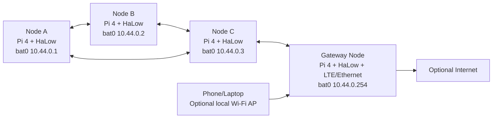
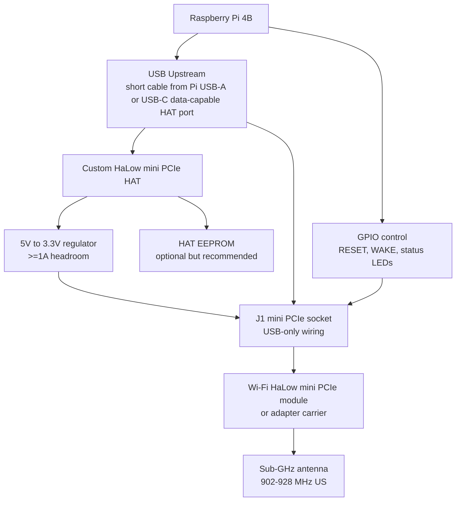

# Raspberry Pi 4 Wi-Fi HaLow Ad-Hoc MANET Design

**Status:** Draft 0.1  
**Product family:** HexMod Labs / field networking node  
**Goal:** Raspberry Pi 4-based mobile ad-hoc network node using a mini PCIe-style HAT for Wi-Fi HaLow.

---

## 1. Core Design Decision

Use the Raspberry Pi 4 as the Linux/OpenWrt host and treat the HaLow radio as a **USB network device mounted in a mini PCIe-form-factor socket**.

This distinction matters:

- Raspberry Pi 4 Model B does **not** expose a usable PCIe lane on the 40-pin HAT header.
- A Pi 4 mini PCIe HAT can mechanically expose a mini PCIe socket, but electrically it should use **USB 2.0 + 3.3V power** for this project.
- If the HaLow module requires real PCIe signaling, use a Raspberry Pi Compute Module 4/5 carrier or Raspberry Pi 5 PCIe HAT instead.

The first version should therefore be:

```text
Raspberry Pi 4B
  |
  | USB 2.0/3.0 cable or internal USB pigtail
  v
Custom mini PCIe HaLow HAT
  |
  | USB D+/D-, 3.3V, reset, wake, antenna
  v
Wi-Fi HaLow module
  |
  v
802.11ah MANET overlay
```

---

## 2. Recommended Network Architecture

Build the MANET as a Layer 2 mesh overlay using `batman-adv` on top of the HaLow interface.

Why:

- `batman-adv` is in the Linux kernel networking stack.
- It creates a virtual `bat0` interface that behaves like an Ethernet segment.
- It can carry IPv4, IPv6, DHCP, mDNS, SSH, web apps, telemetry, and custom services over the mesh.
- It works over Ethernet-like lower interfaces, which is the right abstraction if the HaLow driver exposes a normal Linux network interface.

Preferred topology:



Node roles:

| Role | Hardware | Function |
|---|---|---|
| Mesh node | Pi 4 + HaLow HAT | Participates in HaLow MANET |
| Relay node | Pi 4 + HaLow HAT + battery | Positioned for range extension |
| Gateway node | Pi 4 + HaLow HAT + LTE/Ethernet | Bridges MANET to WAN |
| Service node | Pi 4 + storage | Hosts chat, maps, files, telemetry |
| Client bridge | Pi 4 + HaLow + normal Wi-Fi AP | Lets phones/laptops join via regular Wi-Fi |

---

## 3. HaLow Mode Choice

There are three possible radio-layer approaches. Start with the one your driver actually supports.

| Mode | Description | Recommendation |
|---|---|---|
| 802.11s mesh | True Wi-Fi mesh mode at MAC layer | Best if the HaLow driver exposes mesh mode |
| IBSS/ad-hoc | Classic Wi-Fi ad-hoc peer mode | Good if supported, less common in modern stacks |
| AP/STA relay mesh | Each node is AP or station plus routing overlay | Most realistic fallback for vendor HaLow stacks |

The practical software stack should be:

```text
HaLow radio mode that works
  -> Linux interface, e.g. wlan1 or morse0
  -> batman-adv mesh interface bat0
  -> static node IP or mesh DHCP
  -> services: SSH, chat, maps, telemetry, web UI
```

If the HaLow driver supports true 802.11s, use:

```text
wlan1 type mp
wlan1 mesh join hexmesh-halow
batman-adv over wlan1
```

If it only supports AP/STA, use:

```text
HaLow AP/STA links
batman-adv over the HaLow interface where possible
or Babel/OLSR over IP if L2 forwarding is blocked
```

---

## 4. Hardware Block Diagram



---

## 5. Custom mini PCIe HAT Electrical Design

### 5.1 Pi 4 HAT Header Usage

The 40-pin header should supply power/control only. It should not pretend to carry PCIe.

| Pi Header Pin | Signal | HAT Net | Use |
|---:|---|---|---|
| 2 or 4 | +5V | `+5V_PI` | Input to HAT regulator |
| 6/9/14/20/25/30/34/39 | GND | `GND` | Ground |
| 1 or 17 | +3V3 | `PI_3V3` | Logic reference only |
| 3 | GPIO2/SDA1 | `HAT_ID_SDA` | Optional HAT EEPROM |
| 5 | GPIO3/SCL1 | `HAT_ID_SCL` | Optional HAT EEPROM |
| 11 | GPIO17 | `HALOW_RESET_N` | Module reset via level-safe control |
| 13 | GPIO27 | `HALOW_WAKE` | Optional wake/control |
| 15 | GPIO22 | `HALOW_DISABLE_N` | Optional radio disable |
| 16 | GPIO23 | `HALOW_STATUS` | Optional status input |
| 18 | GPIO24 | `LED_MESH` | Mesh status LED |
| 22 | GPIO25 | `LED_LINK` | Link status LED |

### 5.2 USB Upstream

Because the Pi 4 header does not expose USB data, the HAT needs one of these:

| Option | Recommendation | Notes |
|---|---|---|
| Short USB-A to HAT cable | Best first prototype | Use a right-angle USB-A pigtail from Pi USB port to HAT |
| HAT-mounted USB-C device connector | Good custom design | The HAT appears as a USB device/peripheral board to the Pi |
| Internal soldered USB test-pad cable | Compact but less serviceable | Fine for enclosure integration |
| GPIO-only USB | Do not use | Pi 4 40-pin header does not provide USB D+/D- |

Recommended upstream connector:

```text
J_USB_UP
1 VBUS from Pi USB port, optional sense only
2 USB_D-
3 USB_D+
4 GND
5 SHIELD_GND
```

Use the Pi header `+5V_PI` for power if you want the HAT powered from GPIO, but use the USB connector for data.

### 5.3 mini PCIe Socket Wiring

Wire the mini PCIe socket as a **USB-only radio slot**.

```text
J1 mini PCIe socket, USB-only subset

Power:
  3.3V pins -> +3V3_HALOW
  GND pins  -> GND

USB:
  USB_D- -> USB_HALOW_D_N
  USB_D+ -> USB_HALOW_D_P

Control:
  W_DISABLE# -> HALOW_DISABLE_N
  PERST# or module reset equivalent -> HALOW_RESET_N if supported
  WAKE# -> HALOW_WAKE if supported

Not connected:
  PCIe TX/RX pairs
  PCIe REFCLK
  SIM/UIM pins unless the module requires them
  1.5V pins unless the selected module explicitly requires them
```

Schematic notes:

- Put ESD protection near the USB connector and any external-facing antenna or socket edge.
- Put common-mode choke footprint on USB D+/D- as DNI or populated depending on EMI testing.
- Add 0R links on reset, wake, and disable lines.
- Add a current-sense test jumper or 0.05 ohm sense resistor footprint on `+3V3_HALOW`.
- Use a dedicated 3.3V regulator rather than relying on Pi 3.3V.

---

## 6. HaLow Module Candidates

### Preferred Development Path

Start with a known-good Raspberry Pi 4 HaLow evaluation platform before designing the mini PCIe HAT.

Morse Micro currently lists Raspberry Pi 4B-based Wi-Fi HaLow evaluation kits using MM6108/MM8108 hardware and OpenWrt/Linux software. Their MM6108 EKH01 brief describes a Pi 4B platform with MM6108 Wi-Fi HaLow, Linux/OpenWrt, antenna, power adapter, Ethernet/USB/HDMI/serial access, and AP/Station/Router use.

### Module/Radio Ecosystem Notes

Morse Micro's current module ecosystem includes:

- Quectel FGH100M / FGH100M-H / FGH200M modules.
- Silex SX-SDMAH.
- Gateworks GW16167 M.2 2230 E-Key with USB signaling.
- AzureWave, AsiaRF, FN-Link, Acsip, Vantron partner modules.

For a mini PCIe HAT, prioritize modules or adapter cards that expose **USB** to the host. If the attractive module is M.2 E-Key USB signaling, build or buy an M.2-to-mini-PCIe-style adapter only if you control pin mapping and mounting.

### US Band

For the United States, target 902-928 MHz HaLow hardware and antennas. Do not use Japan/EU-only band hardware for a US build.

---

## 7. MANET Software Architecture

### 7.1 Operating System

Recommended:

- **OpenWrt** if the HaLow vendor SDK supports it cleanly.
- **Raspberry Pi OS Lite** if you want maximum Debian package comfort and the driver builds reliably.

Morse Micro's Raspberry Pi 4 evaluation kit is documented as Linux/OpenWrt-based, so OpenWrt is the safest first target.

### 7.2 Mesh Stack

Preferred:

```text
HaLow interface: wlan1 / morse0 / vendor name
Mesh overlay: batman-adv
Mesh interface: bat0
Node IP: static 10.44.0.x/16
Optional IPv6: fd44:4d41:4e45::/64
```

Fallback:

```text
HaLow interface: IP-routed AP/STA link
Routing daemon: Babel or OLSR
Node IP: static per-node
Gateway advertisement: only from nodes with LTE/Ethernet
```

### 7.3 Base Services

| Service | Purpose |
|---|---|
| SSH | Admin access |
| Avahi/mDNS | Local service discovery |
| Nginx or Caddy | Local node dashboard |
| Syncthing or rsync | File sync across mesh |
| Matrix/Reticulum/MQTT | Messaging/telemetry layer |
| GPSD | Optional node location |
| Prometheus node exporter | Optional metrics |

---

## 8. Example batman-adv Bring-Up

This is a shape, not a final copy/paste script. Interface names depend on the HaLow driver.

```bash
sudo modprobe batman-adv

sudo ip link set wlan1 down
sudo iw dev wlan1 set type mesh
sudo ip link set wlan1 up
sudo iw dev wlan1 mesh join hexmesh-halow freq 922000

sudo ip link add name bat0 type batadv
sudo ip link set dev wlan1 master bat0
sudo ip link set up dev bat0
sudo ip addr add 10.44.0.11/16 dev bat0
```

Diagnostics:

```bash
batctl -m bat0 if
batctl -m bat0 n
batctl -m bat0 o
batctl -m bat0 ping 10.44.0.12
ip addr show bat0
iw dev
```

If the driver does not support `iw ... set type mesh`, use the vendor's AP/STA configuration method and then place `batman-adv` or a Layer 3 routing daemon above the resulting interface.

---

## 9. Addressing Plan

Use deterministic per-node addressing.

| Node | bat0 IPv4 | Role |
|---|---|---|
| Node 01 | 10.44.0.1/16 | Control/base |
| Node 02 | 10.44.0.2/16 | Relay |
| Node 03 | 10.44.0.3/16 | Relay |
| Node 10 | 10.44.0.10/16 | Mobile terminal |
| Node 254 | 10.44.0.254/16 | Gateway |

Hostname pattern:

```text
hexmesh-001
hexmesh-002
hexmesh-gw1
```

SSID/mesh ID:

```text
hexmesh-halow
```

---

## 10. Gateway Node Design

The gateway node should have:

- HaLow MANET interface.
- Ethernet or LTE WAN.
- Firewall rules.
- Optional DHCP/DNS for client bridge mode.
- Optional normal 2.4 GHz Wi-Fi AP for phones/laptops.

Gateway traffic model:

```text
bat0 mesh network
  -> gateway node firewall/NAT
  -> LTE/Ethernet WAN
```

Keep the mesh useful without Internet. Gateway should be additive, not required.

---

## 11. Power and Enclosure

### Portable Node

| Part | Power Notes |
|---|---|
| Raspberry Pi 4B | Use a solid 5V 3A supply or battery converter |
| HaLow HAT | Use dedicated 3.3V regulator with >=1A headroom |
| LTE gateway add-on | Separate high-current rail if used |
| Fan/heatsink | Pi 4 gets hot in sealed field enclosures |

### Enclosure Notes

- Put HaLow antenna outside or on an RF-friendly edge.
- Avoid placing the antenna directly beside USB 3 cables or switching regulators.
- Use a proper 902-928 MHz antenna for US builds.
- Provide strain relief for antenna connector and USB pigtail.
- Add labels for node ID, IP, and role.

---

## 12. Prototype Plan

### Phase 0: Vendor Eval Kit

Goal: learn the real HaLow driver and supported modes.

Acceptance tests:

- Pi boots vendor image.
- HaLow interface appears.
- AP/STA mode works.
- Check whether `iw list` reports mesh/IBSS support.
- Confirm frequency/channel settings for US 902-928 MHz.
- Run two-node ping and iperf.

### Phase 1: MANET Software

Goal: prove multi-hop behavior before custom hardware.

Minimum setup:

- 3 Pi nodes.
- 3 HaLow radios.
- Static IPs.
- `batman-adv` or Babel fallback.

Acceptance tests:

- Node A can reach Node C through Node B with A and C out of direct range.
- Route recovers when Node B moves or powers down.
- Gateway node can provide optional WAN.
- Local service remains available without WAN.

### Phase 2: USB mini PCIe HAT Prototype

Goal: prove the custom HAT can host the HaLow module.

Acceptance tests:

- HAT powers module without brownout.
- Module enumerates over USB.
- Reset/disable GPIOs work.
- Antenna placement is mechanically sane.
- Current draw is measured during idle, association, and transmit.

### Phase 3: Field Node

Goal: rugged portable MANET node.

Acceptance tests:

- Runs from battery for target runtime.
- Handles thermal load in enclosure.
- Maintains multi-hop connectivity outdoors.
- Survives power loss/reboot without manual intervention.

---

## 13. Open Questions Before KiCad

1. Which HaLow module/card exactly?
2. Is the desired HAT socket mini PCIe for mechanical convenience, or is M.2 E-Key acceptable?
3. Should the HAT include a USB hub for extra devices?
4. Is this OpenWrt-first or Raspberry Pi OS-first?
5. Do nodes need GPS for mapping/location-aware routing?
6. Does the gateway node include LTE?
7. Is the system personal/prototype-only or eventual product/kit?

---

## 14. Suggested First BOM

| Item | Qty | Notes |
|---|---:|---|
| Raspberry Pi 4B, 4GB or 8GB | 3 | Minimum useful MANET testbed |
| Official-quality 5V 3A supplies | 3 | Avoid false RF/software debugging from brownouts |
| Morse Micro Pi 4 HaLow eval kit or equivalent | 2-3 | Start with known-good stack |
| Sub-GHz antennas matched to module region | 3 | 902-928 MHz for US |
| Portable USB battery packs | 3 | Field test |
| GPS USB dongle or HAT | 1-3 | Optional location telemetry |
| LTE USB modem | 1 | Gateway node only |

---

## 15. Source Notes

Current public references checked for this draft:

- Raspberry Pi 4 official product page: https://www.raspberrypi.com/products/raspberry-pi-4-model-b/
- Morse Micro products page: https://www.morsemicro.com/products/
- Morse Micro modules page: https://www.morsemicro.com/modules/
- Morse Micro evaluation kits page: https://www.morsemicro.com/evaluation-kits/
- Morse Micro MM6108 EKH01 product brief: https://www.morsemicro.com/wp-content/uploads/2024/12/MM6108-EKH01-Product-Brief-2.pdf
- Linux kernel `batman-adv` documentation: https://docs.kernel.org/networking/batman-adv.html

